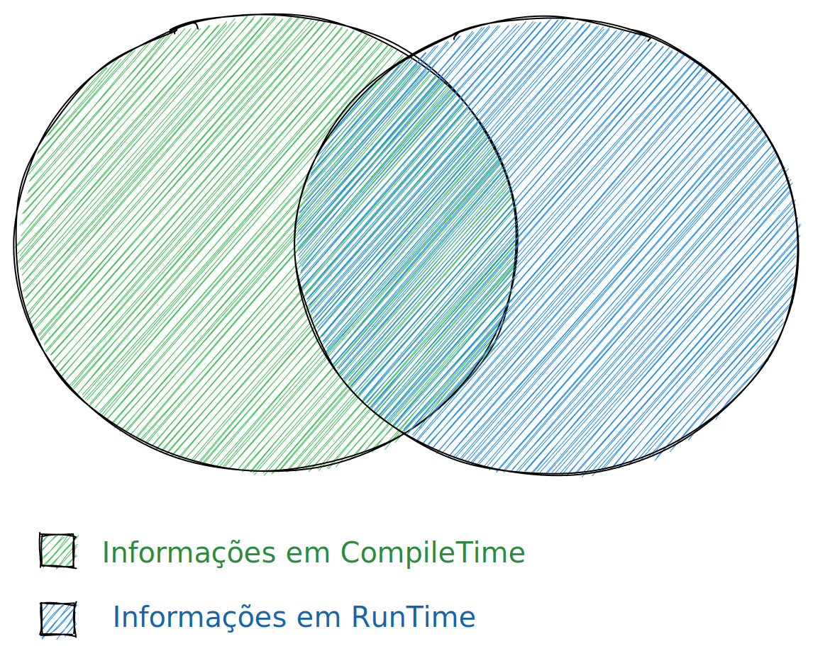

# Go generics

Polimorphismo em tempo de execução.

-------------

```golang
t := reflect.TypeOf(value)
v := reflect.ValueOf(value)
```

-------------



-------------

Extrair, Criar e Verificar tipos de valores em tempo de execução.

-------------

Um exemplo extraindo os campos de uma struct.

```golang
for i := 0; i < t.NumField(); i++ {
	// Reflection panics if you access a value that is unexported
	if t.Field(i).IsExported() {
		fmt.Printf("%s: %v\n", t.Field(i).Name, v.Field(i).Interface())
	}
}
```

-------------

Aqui podemos acessar todas as informações que o golang sabe.


-------------

## Tags

Muito utilizada para
- Validação
- Serialização e Deserialização

-------------

## Tags - Exemplo
```golang
type User struct {
	Username string
	Password string `mask:"empty"`
}
```

-------------

## Tags - Exemplo

```golang
for i := 0; i < t.NumField(); i++ {
	if t.Field(i).IsExported() {
		fmt.Printf(
			"%s: %s\n",
			t.Field(i).Name,
			t.Field(i).Tag.Get("mask"))
	}
}
```

-------------

## Por que utilizar reflection?

Você consegue reaproveitar codigo. Escrevendo uma função para todos os tipos.

Então você evita, que seu codigo fique assim.

-------------

```golang
func DoSomethingUser() { ... }
func DoSomethingProduct() { ... }
func DoSomethingBusiness() { ... }
func DoSomethingSomething() { ... }
func DoSomethingSomething2() { ... }
...
func DoSomethingSomethingNth() { ... }
```

-------------

## Demo

